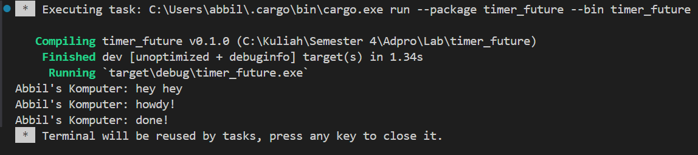

# Tutorial-8
---
#### Nama: Abbilhaidar Farras Zulfikar
#### NPM: 2206026012
#### Kelas: Adpro A
---
### Refleksi

Dari hasil pengamatan, dapat dilihat bahwa fungsi async akan dijalankan di luar fungsi utama yang menjalankannya. Oleh karena itu, "hey hey" bisa saja dioutput terlebih dahulu sebelum "howdy!" dan "done!" karena "hey hey" berada di luar fungsi async yang akan melanjutkan program dan menjalankan <code>println!("hey hey");</code> saat fungsi async masih menunggu hasil dari future.
