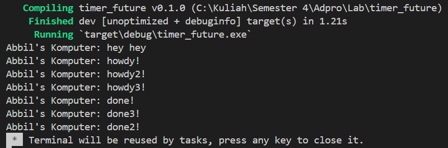

# Tutorial-8
---
#### Nama: Abbilhaidar Farras Zulfikar
#### NPM: 2206026012
#### Kelas: Adpro A
---
### Refleksi

Dari hasil pengamatan, dapat dilihat bahwa fungsi async akan dijalankan di luar fungsi utama yang menjalankannya. Oleh karena itu, "hey hey" bisa saja dioutput terlebih dahulu sebelum "howdy!" dan "done!" karena "hey hey" berada di luar fungsi async yang akan melanjutkan program dan menjalankan <code>println!("hey hey");</code> saat fungsi async masih menunggu hasil dari future.

Dari hasil output yang dihasilkan, terlihat bahwa keberadaan banyak spawner menyebabkan lebih banyak tugas yang dilakukan karena lebih banyak tugas yang di-queue ke dalam pengirim tugas yang bertindak seperti antrian pesan. Tidak menjatuhkan spawner menyebabkan program tidak pernah berhenti karena program mengasumsikan bahwa akan ada transmisi data oleh spawner. drop(spawner) sendiri merupakan indikasi bahwa interaksi sudah selesai dan spawner akan ditutup. Ketika sebuah spawner memanggil fungsi spawn, akan dibuat sebuah tugas baru yang dikirimkan ke pengirim tugas. Eksekutor akan mengambil satu tugas dari pengirim tugas dan menjalankannya, kemudian mengambil tugas lainnya sampai tugas habis dan spawner di-drop yang menandakan interaksi sudah selesai.
